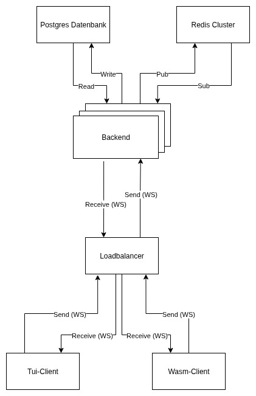

Gliederung
===
1. Zielsetung
2. Architektur
3. Implementierung
4. Showcase
5. Weiterentwicklung
6. Reflexion
7. Fazit


Zielsetzung
===
- Erstellen einer Chat-Plattform
- Ereichbarkeit über das Terminal und den Browser
- Kommunikation über WebSockets
- Speichern der Nachrichten in einer Datenbank
- Speichern der Clients in Redis Cache


Architektur
===




Implementierung - TalkProtokoll
===
```rust
pub struct TalkMessage {
    pub uuid: Uuid,
    pub username: String,
    pub text: String,
    pub room_id: i32,
    pub unixtime: u64
}
```
--> Probleme

- Wie signalisiert man eine Raumänderung?
- Wie werden Errors angezeigt?
- Wie kann man mehrere Nachrichten empfangen bei einem fetch?


Implementierung - TalkProtokoll
===
```rust
pub enum TalkProtocol {
    // Client -> Server Commands
    JoinRoom { room_id: i32, uuid: Uuid, username: String, unixtime: u64},
    LeaveRoom { room_id: i32, uuid: Uuid, username: String, unixtime: u64},
    ChangeName {uuid: Uuid, username: String, old_username: String, unixtime: u64},
    Fetch { room_id: i32, limit: i64, fetch_before: u64},
    LocalError { message: String },

    // Server -> Client Events
    UserJoined { uuid: Uuid, username: String, room_id: i32, unixtime: u64 },
    UserLeft { uuid: Uuid, username: String, room_id: i32, unixtime: u64  },
    UsernameChanged {uuid: Uuid, username: String, old_username: String, unixtime: u64},
    History { text: Vec<TalkProtocol> },
    Error { code: String, message: String },

    // Server <-> Client
    PostMessage { message: TalkMessage },
}
```


Implementierung - Funktionen des Clients
===
| Befehl | Beschreibung |
| --- | --- |
| **/help** | Zeigt Informationen zu den verfügbaren Befehlen |
| | |
| **/clear** | Löscht den Chatverlauf |
| | |
| **/name {String}** | Setzt den Nutzernamen |
| | |
| **/room {Integer}** | Wechselt den Raum |
| | |
| **/fetch {Integer}** | Holt, ausgehend von der ersten Nachricht im Chatverlauf, die vorherigen Nachrichten |


Showcase
===
**Wasm-Client**

- `http://aicon.dhbw-heidenheim.de:7777`
- Manche Browser verbieten ungeschützte WebSockets

**Tui-Client**

- Installation über cargo
    - `cargo install tuitalk`
    - `tuitalk ws://aicon.dhbw-heidenheim.de:8079`

- Manuelle Installation
    - Repo clonen (`git clone https://github.com/itsAnian/TuiTalk.git`)
    - In den Rust Folder wechseln (`TuiTalk/rust`)
    - `cargo run -p client ws://aicon.dhbw-heidenheim.de:8079`


Weiterentwicklung
===
- Wasm löschen
- WebSocket austauschen durch WebSocket Secure
- Timestamp Änderung, sodass diese vom Server hinzugefügt wird
- Tui-Client erweitern
    - Namen der Teilnehmer anzeigen
    - Scrollen bei der Nachrichteneingabe
    - /whisper Funktion
- (Peer-to-Peer?)


Reflexion
===
- Rust war inital sehr aufwendig zu lernen
- Wasm Client Entwicklung wurde begonnen
    - kläglich gescheitert
    - Negative Einstellung gegenüber Wasm -> Vernachlässigung
    - konnte nicht sein volles Potential eintfalten


Fazit
===
- Rust trotz hohem initalem Aufwand gut zu verwenden
- Funktionierende Chat-Plattform mit unterschiedlichen Clients
- Das Projekt wird auf für uns wichtiges reduziert und weiterentwickelt
